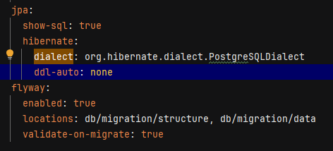
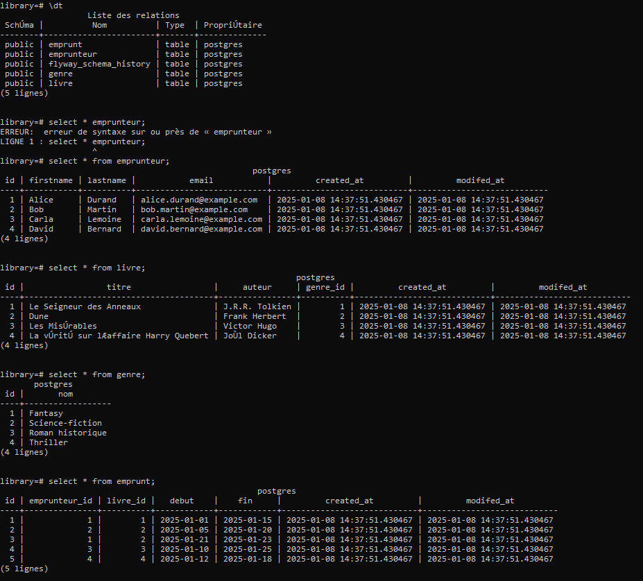

### Etapes de réalisation Brief 15 ###

Configuration de l'environnement :
- spring initializr avec : spring web, lombok, jpa, flyway, postgres
- connection et création d'une database "library" en postgres avec configuration de 
celle-ci dans le le fichier application.yml
- configuration de flyway au sein du fichier application.yml avec locations pour définir les 
routes des fichiers de migration 

Ecriture des fichiers qui vont interagir avec la bdd :
@Entity, @Repository et @Service pour chaque objet relationnel (genre,livre, emprunteur, emprunt).

Ecriture des fichiers de migration dans resources/db/migration :
- structure contient le / les fichiers de création des tables,
- data contient le / les fichiers de définition des valeurs insérées dans les tables.
- les fichiers doivent avoir des numeros de façon à être lus dans le bon ordre pour la création et 
l'insertion des données. 
- Après avoir tenté plusieurs migrations avec de nombreuses erreurs, j'ai préféré supprimer l'id 1 de la table 
flyway_schema_history (pour que tout soit propre).
- lancement de mon application et vérification de la migration (ci-dessous).

Schéma de la base après la migration d'un jeu de données test

## Lancer le projet et voir les tests en console ##

Après fork (pour correction) et/ ou démarrage du projet :

- créer une database "library" en postgres
- lancer le projet :
   ./gradlew bootrun

les tests de la base apparaissent en console. 
exemple :

